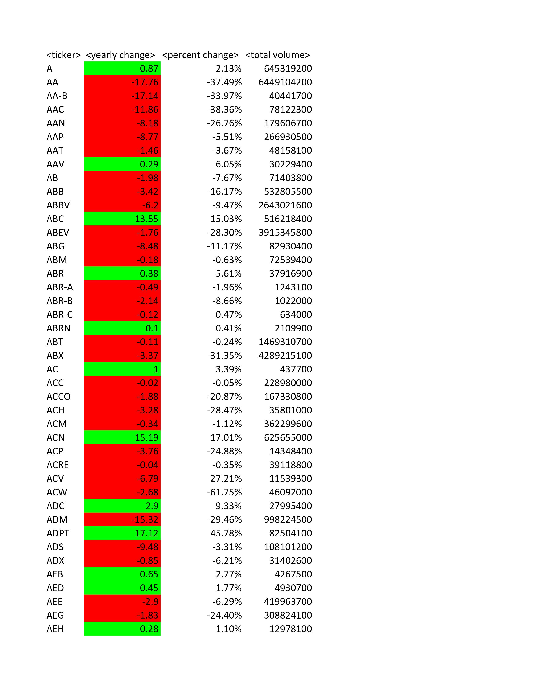

<br />
<p align="center">

  <h3 align="center">Stock Ticker Summary Table</h3>

  <p align="center">
    An explaination for the creation of a summary table from ticker infor
    <br />
    <a href="https://github.com/HsuChe/VBA_challenge"><strong>Project Github URL »</strong></a>
    <br />
    <br />
  </p>
</p>


<!-- ABOUT THE PROJECT -->
## About The Project


There is nothing more important to successful investment than to explore key business indicators to gauge growth for stocks. In this homework we are going to create a summary table for stock products specifically from 2014, 2015, and 2016

Features of the dataset:
* The dataset is divided primarily between three sheets for each of the years that are being analyzed, starting with 2014 and ending on 2016
* The ticker name, date, opening price, highest price for the day, lowest price for the day, closing price, and trade volume for the day
* The dataset is orginized in alphabetical order where the same ticker name are listed one after another. 

There homework is interested generating a few specific items for the summary table.

* The unique ticker names from the dataset
* The price change year on year
* The percentage price change year on year compared to opening price
* The total traded volume for the ticker for a given year based on the sheets. 

<!-- GETTING STARTED -->
## Obtaining list of unique ticker names and total volume traded.

To generate total volume trade, we have to create a volume counter that iterates through each row. 

* For loop on column A
  ```sh
  For i in 2 to LastRowA:
    TotalVolume = TotalVolume + Range("G" & i)
  Next i
  ```

To generate unique names we iterated through each of the rows comparing the value of the current cell in column A with the next iteration, or index + 1. Also make sure that the loop starts at i = 2 as the first index is the header

* For loop on column A
  ```sh
  For i in 2 to LastRowA:
    TotalVolume = TotalVolume + Range("G" & i)
    If Range("A" & i) <> Range("A" & i + 1) Then
        TickerName = Range("A" & i)
  Next i
  ```

### Prerequisites

Some important variables we need to defined for the For loop are LastRowA, which will determine the last used cell in the column and set the range for our loop. The method I used is the following. 

<a href="https://stackoverflow.com/questions/39470412/last-row-in-column-vba"><strong>Code Credit »</strong></a>

* LastRowA
  ```sh
  LastRowA = Worksheet.Cells(Rows.Count, "A").End(xlUp).Row
  ```

We also need to generate the needed headers for the columns that our calculations will return to.

* LastRowA
  ```sh
  Range("I1") = "<ticker>"
  Range("J1") = "<yearly change>"
  Range("K1") = "<percent change>"
  Range("L1") = "<total volume>"
  ```

## Obtaining features needed to calculate price change year on year.

To calculate price change year on year, we would need the opening price for the first iteration of an unique ticker name and the closing price for the last iteration of the same ticker ID.

The dataset is structure where the rows are ordered according to the date. We decided to compare the current iteration of ticker (i) to the next iteration (i + 1) and therefore the index (i) is going to be the last iteration of the unique value. We will be able to get the closing price for that iteration.

* Obtaining Closing Price from our index
  ```sh
  ClosingPrice = Range("F" & i)
  ```

We would also have to extract the opening price for the ticker name. We can extract the opening price for the next unique ticker name by extracting the opening price of i + 1. Because we are extracting opening price for the next iteration of unique ticker name, we would have to declare the first instance of opening price outside of the for loop.

* Obtaining Closing Price from our index
  ```sh
  Dim OpeningPrice as Double
  OpeningPrice = Range("C1")
  ```

Due to the fact that our opening price will be extracted after the current iteration of unique value is calculated, we would have to go ahead and calculate the price change year on year as well as the percentage change against the opening price.

* Store Yearly Change and Yearly Percent Change to memory
  ```sh
  YearlyChange = ClosingPrice - OpeningPrice
  ```

After the calculation is done, we can go ahead and update the opening price for the next unique value.

* Extract Opening Price
  ```sh
  OpeningPrice = Range("C" & i + 1)
  ```

## Error checking for Opening Price.
If yearly percent change uses an opening price that is 0, will draw an error for our calculation. We have to set exceptions for when opening price is 0 on hte first iteration of a unique ticker.

To do this, we would need to insert two different error checkers: 

The first error check is within the conditional when a new unique value is found and before the new opening price is updated. This error will only occur if an entire ticker name does not contain an opening price value from Jan 1 to Dec 31. 

* If OpeningPrice is 0 through every iteration for a ticker, then YearlyPercent is 0
  ``` sd
  If OpeningPrice = 0 Then
    YearlyPercent = 0
  Else
    YearlyPercent = YearlyChange / OpeningPrice
  ```

The Second will be outside the for loop as error checking needs to happen on a per row basis and update opening price to the next none 0 value when it can.

* Second error checking outside the conditional that triggers when unique value is found
  ```sh
  If OpeningPrice = 0 Then
    OpeningPrice = Range("C" & i)
  ```

## Returning all values to the correct column

We can now return the values we calculated from the if statement based on an index specifically desginated for our summary table.

* Return Values to their rightful index in the summary table 
  ```sh
  Range("I" & UniqueCounter) = TickerName
  Range("J" & UniqueCounter) = YearlyChange
  Range("K" & UniqueCounter) = YearlyPercent
  Range("L" & UniqueCounter) = TotalVolume
  ```

## Here are the results we obtained for each year starting with 2014 and ending in 2016

* 2014 Summary page 1, get rest of the pages at [link](Images/2014_summary)<br>

<br>
<br>
* 2015 Summary page 1, get rest of the pages at [link](Images/2015_summary.pdf)<br>

<br>
<br>
* 2016 Summary page 1, get rest of the pages at [link](Images/2015_summary.pdf)<br>

<br>
<br>

## Bonus Questions

The bonus questions asked to find 3 additional calculations. These calculations are the ticker name of the greatest percent increase and the percentage value, the ticker name of the greatest percent decrease and the percentage value, and ticker name of the largest total traded volume in the year and the traded value.

To find out the greatest percentage and the least precentage and greatest total traded we came up with 6 new varialbes.

* We are storing the value and ticker name of the parameters
  ``` sh
  Dim GreatestValue As Double
  Dim GreatestPercent As Double
  Dim GreatestDecrease As Double
  Dim GreatestDecreaseTicker As String
  Dim GreatestPercentTicker As String
  Dim GreatestVolumeTicker As String
  ```


* Set the variable values to 0
``` sh
  GreatestValue = 0
  GreatestPercent = 0
  GreatestDecrease = 0
  ```

We created a for loop for the summary table and compared our variables cell by cell and updating each variable appropriately.

* We are storing the value and ticker name of the parameters
  ``` sh
  For Index = 2 To UniqueIndex
    If GreatestDecrease > Range("K" & Index) Then
      GreatestDecrease = Range("K" & Index)
      GreatestDecreaseTicker = Range("I" & Index)
    ElseIf GreatestVolume < Range("L" & Index) Then
      GreatestVolume = Range("L" & Index)
      GreatestVolumeTicker = Range("I" & Index)
    ElseIf GreatestPercent < Range("K" & Index) Then
      GreatestPercent = Range("K" & Index)
      GreatestPercentTicker = Range("I" & Index)
    End If    
  ```

After we extracted the max for percent change and total traded volume and min for percent change, we can return them to the bonus summary table

* We are storing the value and ticker name of the parameters
  ``` sh
  For Index = 2 To UniqueIndex
    If GreatestDecrease > Range("K" & Index) Then
      GreatestDecrease = Range("K" & Index)
      GreatestDecreaseTicker = Range("I" & Index)
    ElseIf GreatestVolume < Range("L" & Index) Then
      GreatestVolume = Range("L" & Index)
      GreatestVolumeTicker = Range("I" & Index)
    ElseIf GreatestPercent < Range("K" & Index) Then
      GreatestPercent = Range("K" & Index)
      GreatestPercentTicker = Range("I" & Index)
    End If    
  ```

We can now return the extracted data to the correct column and rows of the bonus summary table.

* return the values to the bonus summary table
``` sh
Range("O2") = GreatestPercentTicker
Range("O3") = GreatestDecreaseTicker
Range("O4") = GreatestVolumeTicker
Range("P2") = GreatestPercent
Range("P3") = GreatestDecrease
Range("P4") = GreatestVolume
```

